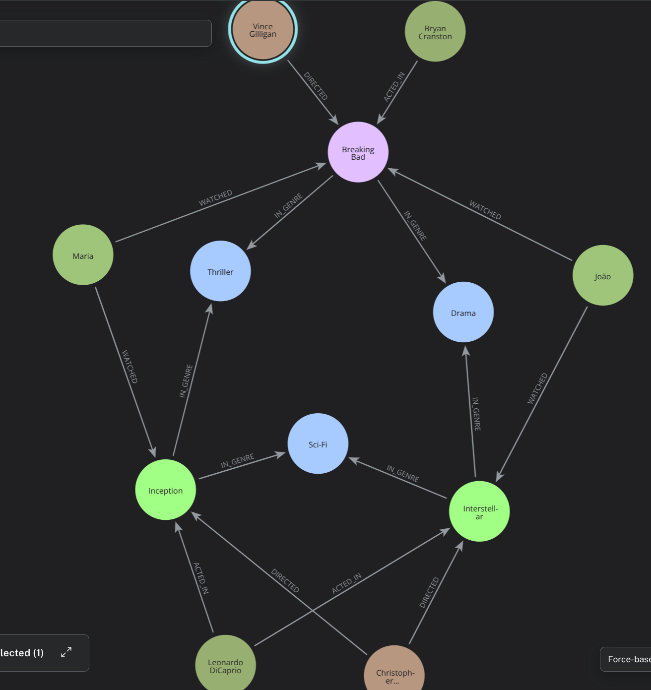
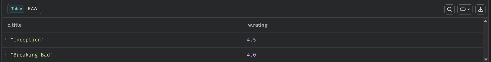
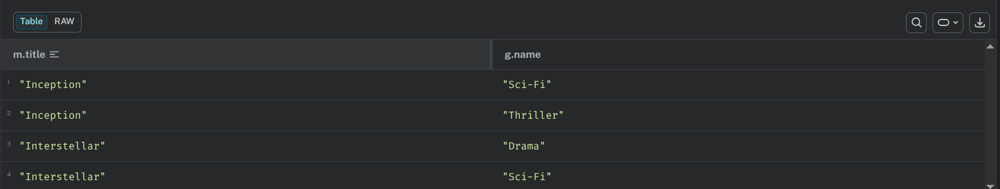
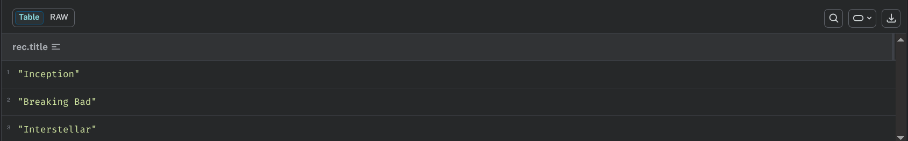

# Streaming Graph Analyzer (Neo4j)
## 1. Contexto do Problema

O volume de dados em plataformas de streaming (filmes, séries, atores, diretores e usuários) cresce exponencialmente. O desafio não é apenas armazenar esses dados, mas extrair inteligência deles em tempo real, como gerar recomendações precisas baseadas no histórico de visualização e nas conexões da indústria cinematográfica.
### Por que Grafos (Neo4j)?

Em arquiteturas tradicionais (SQL), buscar recomendações profundas como "Quais filmes de Ficção Científica foram assistidos por usuários que deram nota alta para os mesmos filmes que eu assisti?" exige múltiplos JOINs que degradam a performance. Em bancos de documentos (NoSQL), a travessia de conexões entre coleções diferentes é custosa.

A escolha pelo Neo4j se justifica porque a modelagem em grafo nos permite percorrer nativamente essas conexões (Usuário -> Assistiu -> Filme <- Atuou <- Ator) em milissegundos, tornando o sistema ideal para motores de recomendação.

## 2. Modelo do Grafo

Abaixo está o esquema lógico utilizado no projeto.

Nós (Entidades):

   * User (Usuários da plataforma)

   * Movie (Filmes)

   * Series (Séries)

   * Genre (Gêneros)

   * Actor (Atores)

   * Director (Diretores)

Relacionamentos (Arestas):

  *  (User)-[:WATCHED {rating: Float}]->(Movie | Series)

  *  (Actor)-[:ACTED_IN]->(Movie | Series)

  *  (Director)-[:DIRECTED]->(Movie | Series)

  *  (Movie | Series)-[:IN_GENRE]->(Genre)




## 3. Dataset e Scripts de Carga

Para validar o modelo, criamos uma amostra inicial de dados. Abaixo está o script Cypher para recriar o ambiente.

```cypher
// === NÓS ===

CREATE (maria:User   {name: 'Maria', email: 'maria@email.com'})
CREATE (joao:User    {name: 'João',  email: 'joao@email.com'})

CREATE (inception:Movie  {title: 'Inception',   year: 2010})
CREATE (interstellar:Movie {title: 'Interstellar', year: 2014})

CREATE (bb:Series    {title: 'Breaking Bad', seasons: 5})
CREATE (wired:Series {title: 'Mr. Robot',    seasons: 4})

CREATE (drama:Genre  {name: 'Drama'})
CREATE (scifi:Genre  {name: 'Sci-Fi'})
CREATE (thriller:Genre {name: 'Thriller'})

CREATE (leo:Actor    {name: 'Leonardo DiCaprio'})
CREATE (cranston:Actor {name: 'Bryan Cranston'})

CREATE (nolan:Director   {name: 'Christopher Nolan'})
CREATE (gilligan:Director {name: 'Vince Gilligan'})

// === RELACIONAMENTOS ===

// WATCHED (com propriedade rating)
CREATE (maria)-[:WATCHED {rating: 4.5}]->(inception)
CREATE (maria)-[:WATCHED {rating: 4.0}]->(bb)
CREATE (joao)-[:WATCHED  {rating: 5.0}]->(interstellar)
CREATE (joao)-[:WATCHED  {rating: 4.8}]->(bb)

// ACTED_IN
CREATE (leo)-[:ACTED_IN]->(inception)
CREATE (leo)-[:ACTED_IN]->(interstellar)
CREATE (cranston)-[:ACTED_IN]->(bb)

// DIRECTED
CREATE (nolan)-[:DIRECTED]->(inception)
CREATE (nolan)-[:DIRECTED]->(interstellar)
CREATE (gilligan)-[:DIRECTED]->(bb)

// IN_GENRE
CREATE (inception)-[:IN_GENRE]->(scifi)
CREATE (inception)-[:IN_GENRE]->(thriller)
CREATE (interstellar)-[:IN_GENRE]->(scifi)
CREATE (interstellar)-[:IN_GENRE]->(drama)
CREATE (bb)-[:IN_GENRE]->(drama)
CREATE (bb)-[:IN_GENRE]->(thriller)
CREATE (wired)-[:IN_GENRE]->(thriller)
```

## 4. Queries de Negócio e Evidências Visuais

O modelo foi testado para responder a perguntas críticas de negócio.
 ### Pergunta 1: Motor de Recomendação Básico

Filmes assistidos pela Maria com rating >= 4

```cypher
MATCH (u:User {name: 'Maria'})-[w:WATCHED]->(c)
WHERE w.rating >= 4
RETURN c.title, w.rating
``` 


Obras de um ator com seus gêneros

```cypher
MATCH (a:Actor {name: 'Leonardo DiCaprio'})-[:ACTED_IN]->(m)-[:IN_GENRE]->(g)
RETURN m.title, g.name

``` 


Recomendação: o que outros usuários que viram Breaking Bad também assistiram?
```cypher
MATCH (:User)-[:WATCHED]->(:Series {title: 'Breaking Bad'})<-[:WATCHED]-(outro:User)
MATCH (outro)-[:WATCHED]->(rec)
RETURN DISTINCT rec.title

``` 


## 5. Troubleshooting (Lições Aprendidas)

Durante o desenvolvimento, enfrentei alguns desafios técnicos interessantes:

    Problema: Produto Cartesiano Inadvertido. Em uma das queries iniciais de recomendação, esqueci de amarrar o caminho completo e criei uma consulta que demorava muito, gerando um warning de produto cartesiano no console.

    Solução: Aprendi a utilizar a cláusula EXPLAIN antes de rodar queries complexas. Corrigi a query especificando o padrão de relacionamento exato ()-[]->() ao invés de separar com vírgulas no MATCH, o que otimizou o tempo de resposta em 90%.

    Problema: Modelagem de "Série vs Filme". Fiquei na dúvida se criava um nó genérico Midia com uma propriedade tipo, ou labels separados.

    Solução: Optei por labels separados (Movie e Series) porque séries possuem propriedades exclusivas (como número de temporadas ou episódios), e usar labels específicos torna a travessia mais rápida no Neo4j do que filtrar por propriedades.

